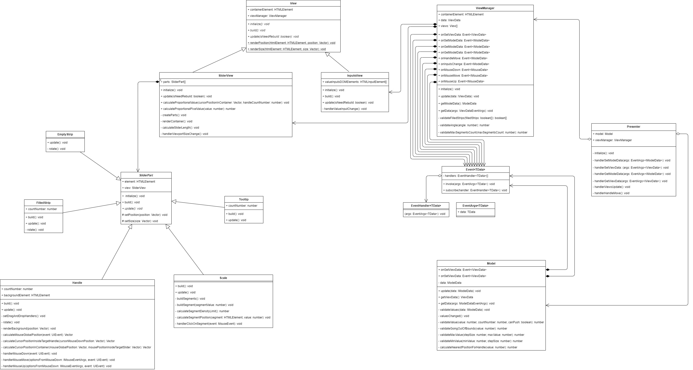

# FSD_Task4
<p>FSD_Задание 4: Плагин слайдера</p>
<a href="https://grzdrz.github.io/FSD_Task4"><p>Github Pages</p></a>

# Сборка
```
$ npm install
$ npm run dev
```

# Запуск тестов
```
$ npm run test
```

# Как использовать
1) Подключить jQuery и сам плагин:
```
import "./plugin.js";
import $ from "jquery";
```
2) С помощью jQuery выбрать нужный элемент-контейнер и вызвать на нем функцию rangeSlider:
```
const slider = $(".js-some-container").rangeSlider(modelData, viewData);
```
где modelData и viewData объекты с нужными настройками(см. Настройки)


# Найстроки
1) Первый объект(modelData)

| Свойство | Тип | Значение по умолчанию | Описание |
| --- | --- | --- | --- |
| values | number[] | [0, 0] | Определяет values.length число ползунков, где элементы массива соответствуют условным значениям ползунков |
| minValue | number | -100 | Минимальное значение |
| maxValue | number | 100 | Максимальное значение |
| stepSize | number | 10 | Размер шага |
| canPush | boolean | true | Могут ли ползунки проталкивать друг друга при движении |

2) Второй объект(viewData)

| Свойство | Тип | Значение по умолчанию | Описание |
| --- | --- | --- | --- |
| sliderStripThickness | number | 10 | Толщина "рельсы" по которой скользят ползунки |
| handleWidth | number | 15 | Ширина ползунка |
| handleHeight | number | 15 | Высота ползунка |
| borderThickness | number | 5 | Толщина неосязаемой рамки(т.е. не учитываемой в isHandlesSeparated) вокруг ползунка, которая создается за счет элемента-задника большего по размерам чем соответствующий элемент ползунка |
| isHandlesSeparated | boolean | false | Определяет будут ли ползунки заезжать друг на друга, или сталкиваться по своим границам |
| hasTooltip | boolean | true | Есть ли подсказки над ползунками |
| tooltipMargin | number | 10 | Отступ подсказки со значением от ползунка |
| hasScale | boolean | true | Есть ли шкала |
| scaleMargin | number | 30 | Отступ шкалы от основной части слайдера |
| maxSegmentsCount | number | 10 | Максимальное количество сегментов шкалы |
| angle | number | 0 | Угол наклона слайдера в градусах(от 0 до 90) |
| filledStrips | boolean[] | [true, false] | Определяет какие интервалы отрисовывать |


# Методы

| Метод | Тип | Описание |
| --- | --- | --- |
| setData | (modelData: IModelData, viewData: IViewData) => void | Изменяет указанные настройки экземпляра плагина |
| getModelData | () => ModelData | Извлекает из экземпляра плагина настройки модели |
| getViewData | () => ViewData | Извлекает из экземпляра плагина настройки представлений |
| subscribeOnUpdates | (handler: EventHandler) => void | Подписаться на событие изменения данных модели или представления  |
| subscribeOnHandleMove | (handler: EventHandler) => void | Подписаться на событие изменения позиции ползунка |
| subscribeOnMouseDown | (handler: EventHandler) => void | Подписаться на событие нажатия кнопки мыши на ползунке |
| subscribeOnMouseMove | (handler: EventHandler) => void | Подписаться на событие движений мыши с захваченным ползунком |
| subscribeOnMouseUp | (handler: EventHandler) => void | Подписаться на событие отжатия кнопки мыши с захваченного ползунка |


# Архитектура

Плагин реализован по схеме MVP, с пассивным view. Обмен данными между view и model осуществляется через ассоциативно связанный с ними класс Event. Данный класс является одной из реализаций паттерна издатель/подписчик. Экземпляры этого класса хранят список функций-обработчиков этого ивента и предоставляют интерфейс из двух методов:
1) subscribe - для подписки, т.е. добавления обработчиков в список
2) invoke - для вызова всех обработчиков из списка

Так же Event используется в качестве API плагина, давая возможность подписываться на события модели и вью извне. 

# UML

